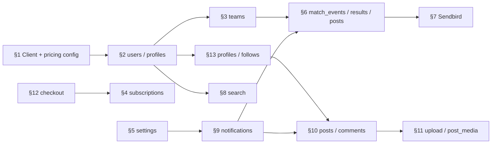

# O’Sport — Guide domaines (backend Laravel 12+)

## Orientation

- Relier chaque **domaine UX** (spec maquettes) aux **responsabilités backend** : routes, persistance, jobs, intégrations.
- Ne pas refaire le détail UI : le consigner dans `osport-design-complet-google-stitch.md` et les fichiers `ecran …`.

## Cohérence d’abord

- Lire **contrôleurs, services et schéma** déjà en place avant d’ajouter table ou route « par écran ».
- Interdire **deux** endpoints pour un même état métier ; résoudre stitch ↔ schéma par **migrations** + **issue produit**, pas par champs improvisés sur `users`.

## Référence rapide

1. **Références obligatoires** — tableau schéma / stitch / Laravel AI.
2. **Alignement Laravel Boost** — ce guide comme couche projet au-dessus de Boost.
3. **Conventions backend** — invariants transverses (auth, médias, billing, Sendbird, notifications).
4. **Design patterns** — contrôleurs ≤ 100 lignes, patterns imposés.
5. **Domaines (design → backend)** — une section par flux maquette.
6. **Dépendances** — graphe Mermaid.
7. **Comment appliquer** — checklist d’implémentation.

## Références obligatoires

| Ressource | Rôle |
|-----------|------|
| `schema-mysql-laravel12-osport.md` | Tables, ordre des migrations, index, règles **Query Builder** vs Eloquent, Sendbird, cycle **score validé → post** |
| `osport-design-complet-google-stitch.md` | Champs affichés, étapes wizard, textes — à traduire en **contrats API** (DTO / Form Request) |
| [Laravel — AI Assisted Development](https://laravel.com/docs/ai) | Cadre officiel **Laravel Boost** : guidelines composables, MCP, doc versionnée |

## Alignement Laravel Boost

- Installer / utiliser **Laravel Boost** selon la [doc officielle](https://laravel.com/docs/ai#ai-guidelines) (`composer require laravel/boost --dev`, `php artisan boost:install`) pour la fondation + paquets détectés + règles **Laravel 11 / 12** (`bootstrap/app.php`, `casts()`, Artisan, tests, etc.).
- **Ce fichier** complète Boost (`CLAUDE.md`, contexte Cursor) ; il ne le remplace pas.

| Attendu Boost / fondation | Pour O’Sport |
|---------------------------|--------------|
| Suivre les conventions **du dépôt** | Voir **Cohérence d’abord** ci-dessus |
| Créer les artefacts avec `php artisan make:*` et `--no-interaction` | Appliquer systématiquement dans le repo |
| Préférer les **tests** aux scripts ou Tinker | Détaillé en **Comment appliquer** |
| APIs : défaut **Eloquent API Resources** si le dépôt ne dit pas le contraire | **Dérogation** : `schema-mysql-laravel12-osport.md` §1.7 — **Query Builder** pour jointures ; pas de métier lourd via relations Eloquent (`with()`, navigation). **`JsonResource`** pour **mapper** le JSON, pas pour charger toute la graphe en Eloquent |
| **search-docs** (MCP Boost) pour la syntaxe exacte | Obligatoire si Boost est branché |
| Concision agent / ne pas créer de doc sans demande | S’applique aux **réponses** ; ce document reste une **spec projet** volontaire |

**Langue** : Boost en anglais ; ce guide en français — les deux peuvent coexister dans le contexte d’un agent.

## Conventions backend (projet O’Sport)

- **Requêtes multi-tables** : Query Builder en **couche principale** ; Eloquent **sans** `with()` ni navigation relationnelle pour le métier lourd — schéma §1.7.
- **Laravel 12** : `bootstrap/app.php` (middleware / exceptions) ; migrations anonymes `return new class extends Migration` ; **`casts()`** sur les modèles ; Form Requests ; **Policies** par ressource.
- **Auth** : `users.email_verified_at` ; reset / OTP : **throttle** ; pas d’énumération de comptes.
- **Fichiers & médias** : valider MIME / taille ; disque + URLs signées ou CDN ; métadonnées dans `post_media` (pas le binaire en base).
- **Prix & Pro** : une seule source (`config`, `subscription_plans`, service billing) ; pas de double backend pour variantes clair/sombre.
- **Messagerie** : conversations dans **Sendbird** ; MySQL = lien user ↔ Sendbird (schéma §1.6).
- **Notifications in-app** : canal `database` + table `notifications` ; respecter les préférences profil / réglages avant d’émettre.

## Design patterns Laravel — règles contractuelles (à suivre à la lettre)

Tout code backend O’Sport doit **respecter explicitement** les dix patterns ci-dessous (structure, nommage, lieu d’enregistrement dans le container). Ce n’est pas du style optionnel : revue de code = refus si contournement sans justification architecturale écrite.

### Règle absolue — taille des contrôleurs

- **Aucun fichier `*Controller.php` ne doit dépasser 100 lignes** (imports et docblocks compris). Au-delà : extraire des **Actions** invokables (`app/Actions/...`), des **Services** métier, des **Repositories** (accès données), ou des **Form Requests** / ressources API déjà prévues.
- Un contrôleur ne fait que : **autoriser**, **valider** (délégation Form Request), **orchestrer** un appel de service / action, **retourner** la réponse (JSON, redirect, resource). Pas de SQL ni de règles métier longues dans le contrôleur.

### Tableau de correspondance (pattern → usage O’Sport)

| Pattern | Rôle | Application O’Sport |
|--------|------|---------------------|
| **MVC** | Séparation données / entrée-sortie / présentation | Modèles pour état simple une table ; contrôleurs minces ; vues ou JSON API. |
| **Injection de dépendances** | Dépendances fournies par le container | Type-hint `RepositoryInterface`, `PaymentGateway`, services dans `__construct`. |
| **Façade** | Accès statique au container | `Cache::`, `Log::`, `Route::`, `DB::` — OK dans couches infra ; éviter d’en abuser dans le cœur métier testable. |
| **Repository** | Abstraction accès données | Interfaces dans `App\Contracts\Repositories` ; implémentations **Query Builder** pour jointures (schéma §1.7), Eloquent uniquement requêtes une table. |
| **Observer** | Effets de bord sur cycle de vie modèle | Ex. après validation d’un `MatchResult` : email, notification database, décrément stock si un jour inventaire — **sans** alourdir le modèle. |
| **Strategy** | Algorithmes interchangeables (runtime ou `.env`) | Paiement PSP, transport, canal de notification transactionnelle — interface + implémentations + `match()` sur `config()`. |
| **Service Provider** | Enregistrement central | `AppServiceProvider::register()` : `bind` / `singleton` ; `boot()` : observers, `Gate::policy`, pas de logique métier lourde. |
| **Singleton** | Une instance coûteuse partagée | Clients HTTP vers APIs externes, parseurs lourds — via `$this->app->singleton()` uniquement quand nécessaire. |
| **Builder** | Construction fluide | `DB::table(...)->join(...)->where(...)` ; requêtes filtres dynamiques pour feed, recherche équipes. |
| **Factory** | Création d’objets sans `new` dispersé | **Factory statique** pour canaux (email / SMS / push) ; **Model Factories** pour tests et seeds. |

### Exemple imposé — Strategy + Factory + DI + Provider (`config`)

Canal de notification **transactionnelle** (SMS / email / push) choisi par **configuration**, jamais instancié en dur dans un contrôleur. Utiliser un **contrat** dans un namespace dédié pour ne pas entrer en conflit avec les classes `Notification` de Laravel.

```php
<?php

namespace App\Contracts;

interface OutboundNotificationChannel
{
    public function send(string $to, string $message): void;
}
```

Implémentations concrètes : `App\Notifications\Channels\EmailOutboundChannel`, `SmsOutboundChannel`, `PushOutboundChannel` (chacune implémente `OutboundNotificationChannel`).

**Enregistrement** dans `App\Providers\AppServiceProvider` :

```php
public function register(): void
{
    $this->app->bind(\App\Contracts\OutboundNotificationChannel::class, function () {
        return match (config('services.notification.channel', 'email')) {
            'email' => new \App\Notifications\Channels\EmailOutboundChannel(),
            'sms' => new \App\Notifications\Channels\SmsOutboundChannel(),
            'push' => new \App\Notifications\Channels\PushOutboundChannel(),
            default => throw new \InvalidArgumentException('Canal notification inconnu.'),
        };
    });
}
```

**Clé `config/services.php`** (exemple) : `'notification' => ['channel' => env('OUTBOUND_NOTIFICATION_CHANNEL', 'email')],`

**Contrôleur** (≤ 100 lignes, aucune logique de choix de canal) :

```php
public function __construct(
    private \App\Contracts\OutboundNotificationChannel $notifier,
) {}

public function store(/* OrderStoreRequest $request */): \Illuminate\Http\JsonResponse
{
    // … persistance déléguée à une Action / Service …
    $this->notifier->send($user->email, __('orders.confirmed'));

    return response()->json(/* … */);
}
```

Même principe pour **`PaymentGateway`** (Stripe / PayPal / autre) : interface + stratégies + `bind` conditionnel sur `config` ou sur le choix validé en base — le contrôleur reçoit **`PaymentGateway`** injecté ou un **`PaymentService`** qui encapsule la stratégie.

---

## Domaines (design → backend)

Chaque § lie un **document design** (stitch) au **focus backend**.

### 1. Onboarding marketing & premier paywall → `les premier ecran de direction.md`

- **Côté API** : souvent **aucune** persistance obligatoire ; éventuellement `user_profiles.onboarding_completed_at` ou flags équivalents si le produit impose de rejouer l’intro.
- **Paywall** : lire offre depuis **`subscription_plans`** ; ne pas coder les montants en dur dans les contrôleurs.
- **Doublons maquettes** : un seul module « checkout intent » partagé avec **§12** et **§4**.

### 2. Authentification & cycle de compte → `ecran de connection et d'inscription.md`

- **Tables** : `users`, `user_profiles`, `user_sports`, `sports` ; vérification email = mise à jour `email_verified_at`.
- **Inscription multi-étapes** : soit **une** ressource progressive (PATCH partiels + Form Requests par étape), soit transaction finale — éviter les `users` orphelins sans profil si le client abandonne.
- **Sports** : pivot `user_sports` (contraintes unicité `(user_id, sport_id)` selon migration).
- **Mot de passe oublié / OTP** : réutiliser les patterns Laravel (notifications, `password_reset_tokens`) ; si OTP custom, TTL court (**cache** ou table avec expiration) + `throttle` sur les routes.
- **OAuth** : tokens uniquement serveur ; jamais de secrets dans le mobile en clair.

### 3. Équipes (création & gestion) → `ecran de creation d'equipe.md`

- **Tables** : `teams`, `team_members`, `sports` (catégorie équipe).
- **Autorisation** : Policy `Team` (création, mise à jour, dissolution) + rôle dans `team_members`.
- **Transactions** : création équipe + premier membre (créateur) dans une transaction ; idempotence si le client renvoie le wizard.

### 4. Abonnement & facturation (post-souscription) → `ecran de gestion de paiement.md`

- **Tables** : `subscriptions`, `subscription_plans` ; prorata / changement de forfait = logique métier + webhooks prestataire (Stripe, etc.) — **à aligner** sur les colonnes réelles une fois le billing choisi (le schéma actuel pose les bases ; étendre si besoin `subscriptions` pour périodes / `stripe_subscription_id`).
- **Cartes** : ne jamais stocker le PAN complet ; utiliser l’API du PSP et stocker uniquement les identifiants autorisés.
- **Jobs** : traiter `invoice.paid` / `customer.subscription.updated` en **queued listeners** avec idempotence.

### 5. Paramètres, confidentialité & support → `ecran de gestion de parametres.md`

- **Tables** : champs confidentialité / notif sur `user_profiles` (ou tables dédiées si le schéma les ajoute) ; `user_blocks` pour blocage.
- **API** : endpoints GET/PATCH profil + sous-ressource « notification preferences » ; appliquer les préférences avant d’**émettre** des `Notification` database.
- **Support** : lien vers help center ou tickets — hors schéma SQL de base ; ne pas surcharger `users` si un service externe porte les tickets.

### 6. Matchs, défis & profil équipe → `ecran de gestion des match - gestion de du profil d'equipe.md`

- **Tables cœur schéma** : `match_events`, `match_results`, `teams`, `team_members` ; enchaînement **score validé** → création / upsert **`posts`** avec `match_result_id` unique (voir schéma §1.5).
- **Query Builder** : classements, stats, historiques = agrégations et `JOIN` explicites ; index sur colonnes de filtre (`sport_id`, dates, `team_id`).
- **Fonctions au-delà du schéma actuel** (demandes de match, défis, litiges, export ligue) : modéliser des tables dédiées ou statuts sur `match_events` **avant** d’exposer des routes stables ; documenter les états (machine à états) dans le code (enum PHP 8.2+ backed).
- **Export / partage** : job asynchrone + fichier temporaire ou URL signée si volumineux.

### 7. Messagerie → `ecran de messages.md`

- **Backend Laravel** : provisionnement Sendbird (Platform API), `sendbird_accounts`, endpoint **token session** à courte durée ; pas d’historique SQL des messages.
- **Sécurité** : vérifier que l’utilisateur authentifié ne peut obtenir un token que pour **son** `user_id`.

### 8. Découverte & réseau → `ecran de moteur de recherche.md`

- **Tables** : `user_profiles` (géoloc approximative), `teams`, `follows`, `user_sports`.
- **Recherche** : requêtes paramétrées + index ; géo : formules haversine ou colonnes spatiales MySQL 8 si activées ; **toujours** paginer (`cursor` ou `offset` borné).
- **Invitations / QR** : tokens signés (`URL::temporarySignedRoute`) ou codes courts à usage unique ; rate limiting.

### 9. Notifications in-app → `ecran de notifications.md`

- **Implémentation** : classes `Notification` Laravel, canal `database`, structure JSON `data` stable pour le client.
- **Marquage lu** : colonnes ou table selon évolution ; archivage des vieilles lignes pour la volumétrie (schéma §1.3).
- **Cohérence** : respecter **§5** avant de notifier (opt-in).

### 10. Fil social & posts → `ecran des posts.md`

- **Tables** : `posts`, `post_media`, `comments`, `post_likes`, `comment_likes` ; règles **parties / sous-parties** commentaires (schéma §1.4).
- **Autorisation** : suppression / édition = Policy sur `Post` / `Comment` (auteur ou modération).
- **Fil** : un seul service type `FeedRepository` en Query Builder ; pas de `with()` en cascade sur le fil chaud.

### 11. Création de contenu → `ecran post publication.md`

- **Upload** : `store` temporaire → validation → `post_media` ; transaction `posts` + médias.
- **Queues** : transcodage ou analyse média en `ShouldQueue` ; réponse API « post accepted, processing » si besoin.

### 12. Paywall Pro (marketing) → `ecran forfait de paiement.md`

- **Backend** : lecture plans + création **session** ou **subscription intent** chez le PSP ; webhooks pour état réel.
- **Une seule** vérité avec **§1** et **§4** (mêmes IDs de plan, mêmes prix affichables côté API pour le client).

### 13. Profil joueur → `ecran profil utilisateur.md`

- **Tables** : `user_profiles`, `follows`, `posts` (grille), éventuellement champs « compte privé » sur profil.
- **Demandes de suivi** : si `private` = true, modéliser une table `follow_requests` (non détaillée dans le schéma minimal) ou statut sur `follows` — **à ajouter par migration** plutôt que logique implicite.

---

## Dépendances (vue d’ensemble)



---

## Comment appliquer (backend)

1. **Identifier la ressource** (`Team`, `Post`, `Subscription`, …) et ouvrir la **migration correspondante** dans `schema-mysql-laravel12-osport.md`.
2. **Créer ou mettre à jour** en respectant la section **Design patterns Laravel** : Form Request → Policy → **contrôleur ≤ 100 lignes** → Action / Service / Repository (Query Builder si jointures).
3. **Vérifier le stitch** uniquement pour les **champs exposés** et les **états** ; ne pas dupliquer la logique métier par « un contrôleur par maquette ».
4. **Billing & Pro** : centraliser prix et périodes ; les webhooks mettent à jour `subscriptions` — l’API lecture reflète la base.
5. **Tests** : `PHPUnit` ou `Pest` — au minimum policies, transitions de statut match → `posts`, et idempotence des webhooks ; `Http::fake()` pour Sendbird / PSP ; **mocks** des interfaces (`OutboundNotificationChannel`, `PaymentGateway`) injectées dans les tests unitaires.
6. **Laravel Boost** : si le projet a `laravel/boost`, utiliser **`search-docs`** (ou l’équivalent documenté) avant d’inventer une API framework ; croiser avec les **dérogations** O’Sport (Query Builder §1.7 du schéma).

---

*Aligné sur `osport-design-complet-google-stitch.md` et `schema-mysql-laravel12-osport.md` — Laravel 12 minimum — design patterns e-commerce / cours interne — avril 2026.*
