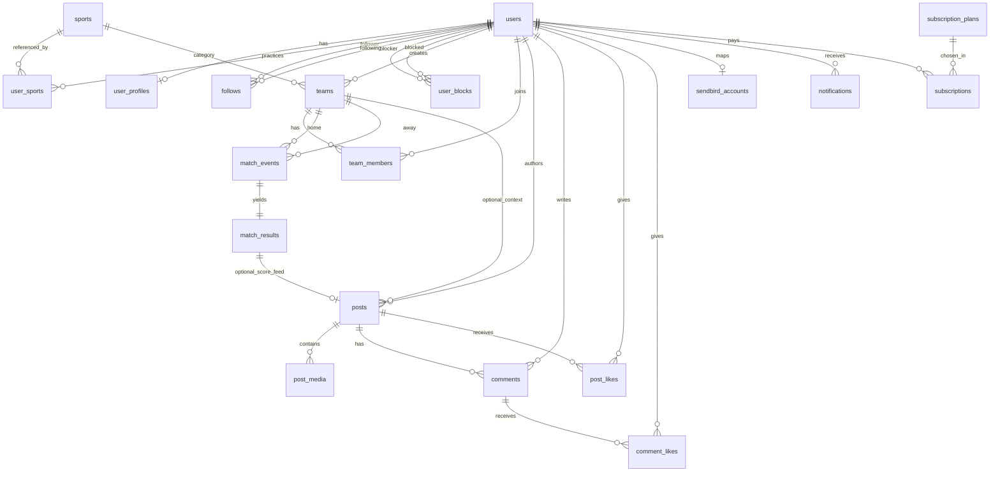

# Schéma MySQL — O’Sport (migrations Laravel 12)

## Orientation

- Documenter en **français** le modèle de données d’un **réseau social sportif** (profil, fil, équipes, matchs, notifications in-app, abonnements).
- Cible technique : **MySQL 8+ / InnoDB / utf8mb4**, intention de scalabilité **≥ 100 000** utilisateurs.
- Messagerie temps réel : **Sendbird** ; ce schéma **ne** persiste **pas** messages ni canaux — uniquement une liaison légère utilisateur ↔ Sendbird.

## Cohérence d’abord

- La convention **§1.7** (Query Builder prioritaire, Eloquent restreint) prime sur les habitudes Laravel « génériques » tant qu’elle n’est pas **explicitement** révisée en équipe.
- Croiser tout changement avec le code existant et `osport-guide-agents-synthese-design.md` ; ne pas introduire un second style d’accès données sans décision documentée.

## Référence rapide

1. **§1** — Principes métier ; **§1.7** — règle d’accès aux données (Query Builder / Eloquent).
2. **§3** — Diagramme entité-relation (Mermaid).
3. **§4** — Ordre recommandé des migrations (FK).
4. **§5** — Migrations Laravel (blocs PHP commentés).
5. **§6 à §8** — Index, profondeur FK, notes MySQL / Laravel.

## Comment appliquer

1. Identifier la **table** et ouvrir le bloc **§5** correspondant.
2. Vérifier **§4** (ordre de création) et **§6** (index / charge).
3. Implémenter les lectures écritures applicatives selon **§1.7**.

---

## 1. Principes et contexte métier

### 1.1 Réseau social complexe

Le produit combine fil d’actualité, interactions sociales, **threads de commentaires** structurés en **parties** (commentaires racines sous un post) et **sous-parties** (réponses imbriquées), ainsi qu’un cycle **match → validation de score → publication automatique** dans le fil lorsque le score est validé.

### 1.2 Règle « au plus trois tables » (profondeur FK courante)

Pour les parcours **fréquents** (fil, profil, « mes équipes », détail match, notifications), on vise au plus **trois sauts de clés étrangères** depuis `users` jusqu’à la donnée affichée, afin de garder des jointures prévisibles sous charge. Les agrégations analytiques hors ligne critique peuvent aller plus loin.

### 1.3 Volumétrie (100 k+ utilisateurs)

Tables potentiellement très chaudes côté MySQL : `posts`, `comments`, `post_likes`, `comment_likes`, `notifications`. Prévoir index composites adaptés, archivage des notifications lues, et à terme partitionnement (souvent par plage de dates ou par hachage de `user_id`) — détaillé en intention dans la section index, pas imposé dans les migrations de base.

### 1.4 Modèle commentaires : parties et sous-parties

- **Partie (racine)** : ligne dans `comments` avec `parent_id` **NULL**, `depth = 0`, `root_comment_id` **NULL** (la racine est sa propre « partie » logique).
- **Sous-partie (réponse)** : `parent_id` → commentaire parent ; `root_comment_id` → **toujours** l’identifiant de la **partie** (racine du fil), pas l’identifiant d’un commentaire intermédiaire.
- **Règle d’insertion** : `root_comment_id = parent.root_comment_id ?? parent.id` (si le parent est la racine, utiliser `parent.id`).

Cela permet de charger tout un fil de discussion par **partie** avec des index `(post_id, root_comment_id, created_at)` sans chaîner des dizaines de jointures.

### 1.5 Match validé → post dans le fil

Lorsqu’un **score est validé**, le backend crée (ou met à jour) **une** ligne `posts` liée au résultat : `posts.match_result_id` est une clé **nullable** et **unique** (un seul post « score validé » par résultat). Le champ `posts.kind` distingue les types de publication (ex. `text`, `media`, `score_validated`).

### 1.6 Messagerie Sendbird vs MySQL

| Responsabilité | Où ça vit |
| --- | --- |
| Messages, canaux (DM / groupe), accusés, typing, pièces jointes chat | **Sendbird** |
| Lier compte app ↔ utilisateur Sendbird, idempotence | **MySQL** (option A ou B ci-dessous) |
| Notifications in-app (follow, like, demande match, hors chat) | **`notifications`** (table du [canal `database`](https://laravel.com/docs/13.x/notifications#database-notifications) des **Laravel Notifications**) |

**Option A (simple)** : colonnes sur `users` : `sendbird_user_id` (chaîne, index unique), éventuellement `sendbird_synced_at`. Aucune FK supplémentaire.

**Option B (table dédiée)** : table `sendbird_accounts` en **1:1** avec `users` — isole l’intégration tiers. **C’est l’option illustrée en migration PHP** ci-dessous ; l’option A peut se déduire en déplaçant les colonnes sur `users` et en supprimant la table.

**Ne pas stocker** durablement : tokens de session Sendbird ; les générer côté backend (Sendbird Platform API) à la demande.

### 1.7 Accès aux données : Query Builder prioritaire, Eloquent limité

Pour l’implémentation applicative O’Sport, la convention du projet est la suivante :

| Couche | Rôle |
| --- | --- |
| **Query Builder** (`Illuminate\Support\Facades\DB`) | **Couche principale** : toutes les requêtes qui **joignent** des tables, suivent les chaînes du §1.2 / §7, alimentent fils d’actualité, profils enrichis, matchs, listes paginées, agrégats, etc. Les relations du schéma se traduisent en **`JOIN` / sous-requêtes explicites**, pas en navigation Eloquent. |
| **Eloquent** | **Usage restreint** : opérations **simples** sur **une** table (lecture / écriture par clé primaire, scopes légers sans charger de relations). **Pas** d’usage des **relations Eloquent** (`hasMany`, `belongsTo`, `with()`, `$user->posts`, etc.) pour charger des données liées. |

Les **migrations** restent en `Schema` / `Blueprint` ; les **clés étrangères** InnoDB restent la référence **structurelle** des liens que le code respecte via Query Builder.

Le **diagramme §3** décrit le **modèle logique** et les jointures possibles en SQL — il ne prescrit pas l’usage des relations Eloquent.

---

## 2. Intégration Sendbird (rappel opérationnel)

1. À l’inscription ou au premier accès au chat : job ou webhook crée l’utilisateur Sendbird si absent, puis enregistre `sendbird_user_id` (option A ou B).
2. Les apps utilisent le **SDK Sendbird** ; MySQL sert de registre d’identité pour retrouver le mapping.
3. Avatar / pseudo affichés dans Sendbird peuvent être synchronisés depuis `user_profiles` (appels API ou webhooks métier — hors périmètre détaillé ici).

---

## 3. Diagramme entité-relation (Mermaid)

> Le diagramme **ne trace pas** la boucle `comments` → `comments` sur `parent_id` (auto-référence) pour rester compatible avec les parseurs Mermaid stricts ; elle est décrite en §1.4 et dans la migration `comments`.  
> Les libellés sur les arêtes sont **logiques** (qui référence qui) : en code, les parcours correspondants passent par du **Query Builder** avec `JOIN`, conformément au §1.7.



---

## 4. Ordre recommandé des migrations

Les tables doivent être créées dans un ordre compatible avec les **clés étrangères**. `match_events` et `match_results` **précèdent** `posts` car `posts.match_result_id` référence `match_results`.

1. `users`  
2. `user_profiles`  
3. `sports`  
4. `user_sports`  
5. `follows`  
6. `user_blocks`  
7. `teams`  
8. `team_members`  
9. `match_events`  
10. `match_results`  
11. `posts`  
12. `post_media`  
13. `comments`  
14. `post_likes`  
15. `comment_likes`  
16. `sendbird_accounts`  
17. `notifications`  
18. `subscription_plans`  
19. `subscriptions`  

> Les migrations Laravel **Breeze / Jetstream** (`password_reset_tokens`, `sessions`, `cache`, etc.) viennent en complément selon ta stack ; elles ne sont pas dupliquées ici.

---

## 5. Migrations Laravel 12 (blocs PHP commentés)

Chaque bloc est une classe anonyme `Migration` telle que générée par `php artisan make:migration` sous Laravel récent. Adapte les noms de fichiers (`xxxx_create_...`).

> **Rappel §1.7** : ces migrations définissent le schéma et les FK ; la lecture / l’écriture métier multi-tables côté application se fait en **Query Builder**, pas via les relations Eloquent.

### 5.1 `users`

Compte minimal d’authentification. Les attributs de profil « riches » vivent dans `user_profiles`.

```php
<?php

use Illuminate\Database\Migrations\Migration;
use Illuminate\Database\Schema\Blueprint;
use Illuminate\Support\Facades\Schema;

return new class extends Migration
{
    public function up(): void
    {
        Schema::create('users', function (Blueprint $table) {
            $table->id();
            $table->string('name');
            $table->string('email')->unique();
            $table->timestamp('email_verified_at')->nullable();
            $table->string('password');
            // Option A Sendbird (alternative à sendbird_accounts) :
            // $table->string('sendbird_user_id')->nullable()->unique();
            // $table->timestamp('sendbird_synced_at')->nullable();
            $table->rememberToken();
            $table->timestamps();
        });
    }

    public function down(): void
    {
        Schema::dropIfExists('users');
    }
};
```

### 5.2 `user_profiles`

Profil affichable, confidentialité et géolocalisation approximative pour la découverte « près de chez moi ».

```php
<?php

use Illuminate\Database\Migrations\Migration;
use Illuminate\Database\Schema\Blueprint;
use Illuminate\Support\Facades\Schema;

return new class extends Migration
{
    public function up(): void
    {
        Schema::create('user_profiles', function (Blueprint $table) {
            $table->id();
            $table->foreignId('user_id')->constrained()->cascadeOnDelete();
            $table->string('display_name', 64)->index();
            $table->string('handle', 32)->unique(); // pseudo @unique
            $table->text('bio')->nullable();
            $table->string('avatar_url', 512)->nullable();
            $table->boolean('is_private')->default(false); // compte privé : follows en pending
            $table->decimal('latitude', 10, 7)->nullable();
            $table->decimal('longitude', 10, 7)->nullable();
            $table->string('city', 120)->nullable()->index();
            $table->timestamps();

            $table->unique('user_id');
        });
    }

    public function down(): void
    {
        Schema::dropIfExists('user_profiles');
    }
};
```

### 5.3 `sports`

Référentiel des sports (faible volumétrie, lecture fréquente). Le champ **`practice_type`** distingue un **sport collectif** (équipe, ballon partagé, etc.) d’un **sport individuel** (tennis solo, course, etc.) — utile pour filtres recherche, règles métier équipes vs profil seul.

```php
<?php

use Illuminate\Database\Migrations\Migration;
use Illuminate\Database\Schema\Blueprint;
use Illuminate\Support\Facades\Schema;

return new class extends Migration
{
    public function up(): void
    {
        Schema::create('sports', function (Blueprint $table) {
            $table->id();
            $table->string('name');
            $table->string('slug')->unique();
            // collective = sport d’équipe ; individual = sport pratiqué seul (valeurs stables côté API)
            $table->string('practice_type', 24)->default('individual')->index();
            $table->timestamps();
        });
    }

    public function down(): void
    {
        Schema::dropIfExists('sports');
    }
};
```

### 5.4 `user_sports` — Sports pratiqués par l’utilisateur (N:N)

Liaison **plusieurs sports par utilisateur** et **plusieurs utilisateurs par sport**, avec attributs de préférence (favori, niveau).

```php
<?php

use Illuminate\Database\Migrations\Migration;
use Illuminate\Database\Schema\Blueprint;
use Illuminate\Support\Facades\Schema;

return new class extends Migration
{
    public function up(): void
    {
        Schema::create('user_sports', function (Blueprint $table) {
            $table->id();
            $table->foreignId('user_id')->constrained()->cascadeOnDelete();
            $table->foreignId('sport_id')->constrained()->cascadeOnDelete();
            $table->boolean('is_favorite')->default(false);
            $table->string('skill_level', 32)->nullable(); // ex. beginner / intermediate / expert
            $table->timestamps();

            $table->unique(['user_id', 'sport_id']);
            $table->index(['sport_id', 'user_id']); // recherche par sport
        });
    }

    public function down(): void
    {
        Schema::dropIfExists('user_sports');
    }
};
```

### 5.5 `follows`

Graphe social (suivi). Le champ `status` permet les demandes pour comptes privés.

```php
<?php

use Illuminate\Database\Migrations\Migration;
use Illuminate\Database\Schema\Blueprint;
use Illuminate\Support\Facades\Schema;

return new class extends Migration
{
    public function up(): void
    {
        Schema::create('follows', function (Blueprint $table) {
            $table->id();
            $table->foreignId('follower_id')->constrained('users')->cascadeOnDelete();
            $table->foreignId('following_id')->constrained('users')->cascadeOnDelete();
            $table->string('status', 24)->default('accepted'); // pending | accepted | rejected
            $table->timestamps();

            $table->unique(['follower_id', 'following_id']);
            $table->index(['following_id', 'status', 'created_at']); // demandes entrantes
        });
    }

    public function down(): void
    {
        Schema::dropIfExists('follows');
    }
};
```

### 5.6 `user_blocks`

Empêche interactions mutuelles (messages côté app, follows, invitations) — à appliquer en couche service.

```php
<?php

use Illuminate\Database\Migrations\Migration;
use Illuminate\Database\Schema\Blueprint;
use Illuminate\Support\Facades\Schema;

return new class extends Migration
{
    public function up(): void
    {
        Schema::create('user_blocks', function (Blueprint $table) {
            $table->id();
            $table->foreignId('blocker_id')->constrained('users')->cascadeOnDelete();
            $table->foreignId('blocked_id')->constrained('users')->cascadeOnDelete();
            $table->timestamps();

            $table->unique(['blocker_id', 'blocked_id']);
            $table->index('blocked_id');
        });
    }

    public function down(): void
    {
        Schema::dropIfExists('user_blocks');
    }
};
```

### 5.7 `teams`

Équipe / club : rattachement au créateur et au sport.

**Index déjà couverts sans ligne dédiée** : `foreignId` sur `creator_id` et `sport_id` crée les index nécessaires aux **FK** ; `unique` sur `name` et `slug` sert à la fois **unicité** et **accès par nom / slug** (fiche équipe, URLs).

**Index composites ajoutés** (lectures type annuaire / « mes équipes créées » ; chaque ligne est commentée dans la migration) :

| Index | Intérêt |
| --- | --- |
| `(sport_id, created_at)` | Liste ou tri chronologique **par sport** (fil d’équipes récentes). |
| `(creator_id, created_at)` | **« Mes équipes que j’ai créées »** avec tri récent : évite un tri coûteux sur gros volume quand seul l’index FK `creator_id` suffit à filtrer mais pas à ordonner. |
| `(sport_id, competition_type, created_at)` | Filtres **sport + loisir / compétitif** (comme à la création / recherche), avec tri par date. |
| `(sport_id, hq_city)` | Recherche **sport + ville** ; l’index seul sur `hq_city` reste utile si tu filtres **ville sans sport**. |

**Non ajoutés (et pourquoi)** : index B-tree séparés sur `hq_latitude` / `hq_longitude` — peu utiles pour du « rayon autour d’un point » ; à prévoir plutôt une stratégie **géo** dédiée (point spatial, grille, service externe) si le produit l’exige. `description` en **TEXT** : pas d’index B-tree classique ; recherche plein texte = **FULLTEXT** ou moteur de recherche si besoin.

```php
<?php

use Illuminate\Database\Migrations\Migration;
use Illuminate\Database\Schema\Blueprint;
use Illuminate\Support\Facades\Schema;

return new class extends Migration
{
    public function up(): void
    {
        Schema::create('teams', function (Blueprint $table) {
            $table->id();
            $table->foreignId('creator_id')->constrained('users')->cascadeOnDelete();
            $table->foreignId('sport_id')->constrained()->restrictOnDelete();
            $table->string('name')->unique();
            $table->string('slug')->unique();
            // $table->string('competition_type', 24)->default('leisure'); // leisure | competitive
            // $table->string('skill_level', 32)->nullable();
            $table->text('description')->nullable();
            $table->string('hq_city', 120)->nullable()->index();
            $table->decimal('hq_latitude', 10, 7)->nullable();
            $table->decimal('hq_longitude', 10, 7)->nullable();
            $table->string('cover_image_url', 512)->nullable();
            $table->string('logo_url', 512)->nullable();
            $table->timestamps();

            $table->index(['sport_id', 'created_at']);
            $table->index(['creator_id', 'created_at']);
            $table->index(['sport_id', 'competition_type', 'created_at']);
            $table->index(['sport_id', 'hq_city']);
        });
    }

    public function down(): void
    {
        Schema::dropIfExists('teams');
    }
};
```

### 5.8 `team_members`

Appartenance **N:N** utilisateurs ↔ équipes avec rôle et statut d’adhésion.

```php
<?php

use Illuminate\Database\Migrations\Migration;
use Illuminate\Database\Schema\Blueprint;
use Illuminate\Support\Facades\Schema;

return new class extends Migration
{
    public function up(): void
    {
        Schema::create('team_members', function (Blueprint $table) {
            $table->id();
            $table->foreignId('team_id')->constrained()->cascadeOnDelete();
            $table->foreignId('user_id')->constrained()->cascadeOnDelete();
            $table->string('role', 32)->default('member'); // captain | member | ...
            $table->string('status', 24)->default('active'); // pending | active | left
            $table->timestamps();

            $table->unique(['team_id', 'user_id']);
            $table->index(['user_id', 'status']);
        });
    }

    public function down(): void
    {
        Schema::dropIfExists('team_members');
    }
};
```

### 5.9 `match_events`

Unité métier « match / défi / demande » entre deux équipes ; évite une chaîne de tables pour les statuts.

```php
<?php

use Illuminate\Database\Migrations\Migration;
use Illuminate\Database\Schema\Blueprint;
use Illuminate\Support\Facades\Schema;

return new class extends Migration
{
    public function up(): void
    {
        Schema::create('match_events', function (Blueprint $table) {
            $table->id();
            $table->foreignId('home_team_id')->constrained('teams')->cascadeOnDelete();
            $table->foreignId('away_team_id')->constrained('teams')->cascadeOnDelete();
            $table->timestamp('scheduled_at')->nullable()->index();
            $table->string('venue', 255)->nullable();
            $table->string('status', 32)->default('scheduled')->index();
            // scheduled | live | finished | cancelled | dispute ...
            $table->text('notes')->nullable();
            $table->timestamps();

            $table->index(['home_team_id', 'status', 'scheduled_at']);
            $table->index(['away_team_id', 'status', 'scheduled_at']);
        });
    }

    public function down(): void
    {
        Schema::dropIfExists('match_events');
    }
};
```

### 5.10 `match_results`

Scores et cycle de validation (proposé, confirmé, contesté). **Après confirmation**, l’application peut créer le `post` de type `score_validated` référencé par `match_result_id`.

```php
<?php

use Illuminate\Database\Migrations\Migration;
use Illuminate\Database\Schema\Blueprint;
use Illuminate\Support\Facades\Schema;

return new class extends Migration
{
    public function up(): void
    {
        Schema::create('match_results', function (Blueprint $table) {
            $table->id();
            $table->foreignId('match_event_id')->constrained('match_events')->cascadeOnDelete();
            $table->unsignedSmallInteger('home_score')->default(0);
            $table->unsignedSmallInteger('away_score')->default(0);
            $table->string('status', 32)->default('pending')->index();
            // pending | validated | disputed
            $table->timestamp('validated_at')->nullable();
            $table->timestamps();

            $table->unique('match_event_id');
        });
    }

    public function down(): void
    {
        Schema::dropIfExists('match_results');
    }
};
```

### 5.11 `posts`

Publications du fil ; `match_result_id` **unique nullable** lie le post automatique au score validé.

```php
<?php

use Illuminate\Database\Migrations\Migration;
use Illuminate\Database\Schema\Blueprint;
use Illuminate\Support\Facades\Schema;

return new class extends Migration
{
    public function up(): void
    {
        Schema::create('posts', function (Blueprint $table) {
            $table->id();
            $table->foreignId('user_id')->constrained()->cascadeOnDelete();
            $table->foreignId('team_id')->nullable()->constrained()->nullOnDelete();
            $table->foreignId('match_result_id')->nullable()->constrained('match_results')->nullOnDelete();
            $table->string('kind', 32)->default('text')->index();
            // text | media | score_validated | ...
            $table->text('body')->nullable();
            $table->string('visibility', 24)->default('public'); // public | followers
            $table->timestamps();
            $table->softDeletes();

            $table->unique('match_result_id'); // au plus un post « score » par résultat
            $table->index(['user_id', 'created_at']);
            $table->index(['team_id', 'created_at']);
        });
    }

    public function down(): void
    {
        Schema::dropIfExists('posts');
    }
};
```

### 5.12 `post_media`

Médias du carrousel ; charge paresseuse possible côté API.

```php
<?php

use Illuminate\Database\Migrations\Migration;
use Illuminate\Database\Schema\Blueprint;
use Illuminate\Support\Facades\Schema;

return new class extends Migration
{
    public function up(): void
    {
        Schema::create('post_media', function (Blueprint $table) {
            $table->id();
            $table->foreignId('post_id')->constrained()->cascadeOnDelete();
            $table->unsignedTinyInteger('position')->default(0);
            $table->string('disk', 32)->default('public');
            $table->string('path', 1024);
            $table->string('mime', 128)->nullable();
            $table->string('type', 16)->default('image'); // image | video
            $table->timestamps();

            $table->index(['post_id', 'position']);
        });
    }

    public function down(): void
    {
        Schema::dropIfExists('post_media');
    }
};
```

### 5.13 `comments`

**Parties** (`parent_id` null) et **sous-parties** (réponses) avec `root_comment_id` et `depth`.

```php
<?php

use Illuminate\Database\Migrations\Migration;
use Illuminate\Database\Schema\Blueprint;
use Illuminate\Support\Facades\Schema;

return new class extends Migration
{
    public function up(): void
    {
        Schema::create('comments', function (Blueprint $table) {
            $table->id();
            $table->foreignId('post_id')->constrained()->cascadeOnDelete();
            $table->foreignId('user_id')->constrained()->cascadeOnDelete();
            $table->foreignId('parent_id')->nullable()->constrained('comments')->cascadeOnDelete();
            $table->foreignId('root_comment_id')->nullable()->constrained('comments')->cascadeOnDelete();
            $table->unsignedTinyInteger('depth')->default(0)->index();
            $table->text('body');
            $table->timestamps();
            $table->softDeletes();

            // Fil d’une même partie sous le post
            $table->index(['post_id', 'root_comment_id', 'created_at']);
            // Navigation hiérarchique dans une partie
            $table->index(['root_comment_id', 'depth', 'created_at']);
            $table->index(['post_id', 'parent_id', 'created_at']);
        });
    }

    public function down(): void
    {
        Schema::dropIfExists('comments');
    }
};
```

### 5.14 `post_likes`

```php
<?php

use Illuminate\Database\Migrations\Migration;
use Illuminate\Database\Schema\Blueprint;
use Illuminate\Support\Facades\Schema;

return new class extends Migration
{
    public function up(): void
    {
        Schema::create('post_likes', function (Blueprint $table) {
            $table->id();
            $table->foreignId('user_id')->constrained()->cascadeOnDelete();
            $table->foreignId('post_id')->constrained()->cascadeOnDelete();
            $table->timestamps();

            $table->unique(['user_id', 'post_id']);
            $table->index(['post_id', 'created_at']);
        });
    }

    public function down(): void
    {
        Schema::dropIfExists('post_likes');
    }
};
```

### 5.15 `comment_likes`

```php
<?php

use Illuminate\Database\Migrations\Migration;
use Illuminate\Database\Schema\Blueprint;
use Illuminate\Support\Facades\Schema;

return new class extends Migration
{
    public function up(): void
    {
        Schema::create('comment_likes', function (Blueprint $table) {
            $table->id();
            $table->foreignId('user_id')->constrained()->cascadeOnDelete();
            $table->foreignId('comment_id')->constrained()->cascadeOnDelete();
            $table->timestamps();

            $table->unique(['user_id', 'comment_id']);
            $table->index(['comment_id', 'created_at']);
        });
    }

    public function down(): void
    {
        Schema::dropIfExists('comment_likes');
    }
};
```

### 5.16 `sendbird_accounts` — Option B Sendbird (1:1)

```php
<?php

use Illuminate\Database\Migrations\Migration;
use Illuminate\Database\Schema\Blueprint;
use Illuminate\Support\Facades\Schema;

return new class extends Migration
{
    public function up(): void
    {
        Schema::create('sendbird_accounts', function (Blueprint $table) {
            $table->id();
            $table->foreignId('user_id')->constrained()->cascadeOnDelete();
            $table->string('sendbird_user_id')->unique();
            $table->timestamp('sendbird_synced_at')->nullable();
            $table->timestamps();

            $table->unique('user_id');
        });
    }

    public function down(): void
    {
        Schema::dropIfExists('sendbird_accounts');
    }
};
```

### 5.17 `notifications` — Laravel 13 (canal `database`)

Les alertes in-app **hors chat** (follow, like, demande de match, etc.) passent par le système [**Notifications**](https://laravel.com/docs/13.x/notifications) de Laravel pour **composer et envoyer** les événements : classes dans `app/Notifications`, canaux (`database`, `mail`, …), file d’attente éventuelle, et persistance via le **canal `database`** dans la table ci-dessous.

**Référence officielle :** [Database notifications — Laravel 13.x](https://laravel.com/docs/13.x/notifications#database-notifications).

**Côté code (aligné projet §1.7 — Query Builder chef) :**

- Générer la migration **officielle** : `php artisan make:notifications-table` puis `php artisan migrate`.
- **Écriture / envoi** : classes `Notification` avec `via()` incluant `'database'`, et **`toArray()`** ou **`toDatabase()`** ; le tableau retourné est encodé en JSON dans **`data`**. Envoi via `Notification::send()`, `notify()`, etc., comme décrit dans la [doc Laravel](https://laravel.com/docs/13.x/notifications). Le trait **`Notifiable`** sur `User` peut servir **uniquement** pour ces helpers d’**envoi** (`notify()`, routage mail/SMS si besoin) — **pas** pour charger l’historique via relations.
- **Lecture, pagination, « marquer comme lu », API mobile** : utiliser le **Query Builder** sur la table `notifications` (filtres `where('notifiable_type', …)`, `where('notifiable_id', …)`, `whereNull('read_at')`, `orderBy('created_at', 'desc')`, `update` ciblé, etc.). **Ne pas** s’appuyer sur les relations Eloquent `notifications`, `unreadNotifications`, `readNotifications` ni sur `markAsRead()` côté collections Eloquent si la convention du projet est d’éviter les relations pour la donnée liée.
- La colonne **`type`** contient par défaut le **nom de classe** de la notification (personnalisable via `databaseType()`).
- Distinct des **push / messages Sendbird** : le chat temps réel ne passe pas par cette table.

**Clés UUID / ULID sur le notifiable :** si `users.id` (ou autre modèle notifiable) est en UUID/ULID, remplacer `morphs('notifiable')` par **`uuidMorphs('notifiable')`** ou **`ulidMorphs('notifiable')`** dans la migration, comme indiqué dans la [note Laravel](https://laravel.com/docs/13.x/notifications#database-prerequisites).

Le bloc ci-dessous est **identique** au stub publié par le framework Laravel 13 (`Illuminate\Notifications\Console\stubs\notifications.stub`) :

```php
<?php

use Illuminate\Database\Migrations\Migration;
use Illuminate\Database\Schema\Blueprint;
use Illuminate\Support\Facades\Schema;

return new class extends Migration
{
    /**
     * Run the migrations.
     */
    public function up(): void
    {
        Schema::create('notifications', function (Blueprint $table) {
            $table->uuid('id')->primary();
            $table->string('type');
            $table->morphs('notifiable');
            $table->text('data');
            $table->timestamp('read_at')->nullable();
            $table->timestamps();
        });
    }

    /**
     * Reverse the migrations.
     */
    public function down(): void
    {
        Schema::dropIfExists('notifications');
    }
};
```

> **Conserver** ce schéma de table (polymorphisme `notifiable_*`, `data`, `type`, `read_at`) pour rester compatible avec le **canal `database`** de Laravel (même payload pour mail + database si besoin). Pour la **lecture**, rester en **Query Builder** (§1.7). Pour des index supplémentaires (ex. boîte de réception filtrée par `read_at`), ajoute une **migration d’alter** après `make:notifications-table`.

### 5.18 `subscription_plans`

```php
<?php

use Illuminate\Database\Migrations\Migration;
use Illuminate\Database\Schema\Blueprint;
use Illuminate\Support\Facades\Schema;

return new class extends Migration
{
    public function up(): void
    {
        Schema::create('subscription_plans', function (Blueprint $table) {
            $table->id();
            $table->string('name');
            $table->string('slug')->unique();
            $table->unsignedInteger('price_cents');
            $table->string('interval', 16); // month | year
            $table->json('metadata')->nullable();
            $table->boolean('is_active')->default(true);
            $table->timestamps();
        });
    }

    public function down(): void
    {
        Schema::dropIfExists('subscription_plans');
    }
};
```

### 5.19 `subscriptions`

```php
<?php

use Illuminate\Database\Migrations\Migration;
use Illuminate\Database\Schema\Blueprint;
use Illuminate\Support\Facades\Schema;

return new class extends Migration
{
    public function up(): void
    {
        Schema::create('subscriptions', function (Blueprint $table) {
            $table->id();
            $table->foreignId('user_id')->constrained()->cascadeOnDelete();
            $table->foreignId('subscription_plan_id')->constrained()->restrictOnDelete();
            $table->string('status', 32)->default('active')->index();
            $table->string('payment_provider', 32)->nullable();
            $table->string('provider_subscription_id')->nullable()->index();
            $table->timestamp('current_period_start')->nullable();
            $table->timestamp('current_period_end')->nullable()->index();
            $table->timestamps();

            $table->index(['user_id', 'status']);
        });
    }

    public function down(): void
    {
        Schema::dropIfExists('subscriptions');
    }
};
```

---

## 6. Index et performance (synthèse)

| Zone | Pattern | Index / remarque |
| --- | --- | --- |
| Fil auteur | Liste des posts d’un user | `(user_id, created_at)` |
| Fil équipe | Posts club | `(team_id, created_at)` |
| Scores dans le fil | Posts `kind = score_validated` | `kind` + jointure optionnelle sur `match_result_id` |
| Parties sous un post | Racines : `parent_id` IS NULL ; enfants par partie | `(post_id, root_comment_id, created_at)` |
| Likes hot | Compteur / « aimé par » | `(post_id, created_at)` sur `post_likes` |
| Notifications | Liste / non lus / marquer lu via **Query Builder** sur `notifications` | `morphs('notifiable')` indexe `(notifiable_type, notifiable_id)` ; optionnel : index composite incluant `read_at` / `created_at` via migration séparée si besoin perf |
| Matchs par équipe | Tableau de bord club | `(home_team_id, status, scheduled_at)` et miroir `away_team_id` |
| Sports (référentiel) | Filtre « collectif vs individuel » (recherche, UX) | index sur `practice_type` ; valeurs attendues `collective` \| `individual` |
| Équipes (annuaire) | Sport + date, sport + type compétition, sport + ville, créateur + date | voir §5.7 : `(sport_id, created_at)`, `(creator_id, created_at)`, `(sport_id, competition_type, created_at)`, `(sport_id, hq_city)` + `hq_city` seul |

**Partitionnement** (phase ultérieure) : `notifications`, `post_likes`, `comments` par mois ou par plage d’`id` ; **archivage** des notifications lues > N jours.

**Charge chat** : quotas et index Sendbird côté service ; **pas** de volumétrie message InnoDB dans ce design.

---

## 7. Profondeur FK depuis `users` (parcours courants)

En implémentation, ces chaînes se traduisent par des **`JOIN`** en **Query Builder** (ou SQL équivalent), pas par du chargement relationnel Eloquent — voir §1.7.

| Besoin | Chaîne | Nombre de sauts |
| --- | --- | --- |
| Profil | `users` → `user_profiles` | 1 |
| Sports pratiqués | `users` → `user_sports` → `sports` | 2 |
| Mes équipes | `users` → `team_members` → `teams` | 2 |
| Matchs / défis (via équipe) | `users` → `team_members` → `teams` → `match_events` | 3 |
| Résultat | `match_events` → `match_results` | +1 depuis l’événement (écran détail) |
| Post lié au score | `match_results` → `posts` | liaison directe optionnelle |
| Fil + médias | `users` → `posts` → `post_media` | 2 |
| Sous-commentaires | `users` → `comments` → `posts` | 2 vers le post ; `root_comment_id` pour regrouper |
| Abonnement | `users` → `subscriptions` → `subscription_plans` | 2 |
| Sendbird (option B) | `users` → `sendbird_accounts` | 1 |
| Notifications in-app | `notifications` filtrées par `notifiable_type` / `notifiable_id` (pas de FK directe vers `users` ; jointure logique côté QB) | 0 saut FK InnoDB ; 1 filtre polymorphique |

---

## 8. Notes Laravel 12 et MySQL

- Charset / collation : `utf8mb4_unicode_ci` (ou `utf8mb4_0900_ai_ci` sur MySQL 8) dans `config/database.php`.
- `foreignId()->constrained()` suppose des `id` bigint unsigned alignés sur les tables référencées.
- **Query Builder (prioritaire)** : fils, profils enrichis, matchs, commentaires, abonnements, **liste des notifications** — `DB::table(…)->join(…)` (ou requêtes paramétrées) ; pas de `with()` ni de parcours via relations Eloquent pour ces besoins (§1.7).
- **Eloquent (secondaire)** : uniquement requêtes **simples** sur une table ; pas de chargement des données liées via le système de relations.
- **Notifications Laravel 13** : [doc Notifications](https://laravel.com/docs/13.x/notifications) + [canal database](https://laravel.com/docs/13.x/notifications#database-notifications) pour **créer / envoyer** (`make:notifications-table`, classes `Notification`, `toArray` / `toDatabase`) ; **lecture et mises à jour** `read_at` en **Query Builder** sur `notifications`.
- Pour une base **déjà déployée** sans `match_result_id`, `kind`, `root_comment_id`, `depth`, `sports.practice_type`, prévoir des migrations `Schema::table(...)` d’**alter** incrémentales.

---

*Document régénéré pour le dépôt `documentation-markdown` — cohérent avec le plan « Schéma MySQL Laravel 12 — messagerie Sendbird » et les extensions « match validé → post » + « parties / sous-parties » sur les commentaires. Convention applicative : **Query Builder** pour les données relationnelles, **Eloquent** limité aux accès simples (§1.7).*
