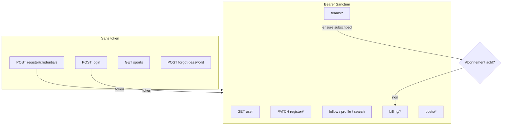

# Documentation API O'Sport — React Native

Manuel d'intégration pour l'application mobile. Toutes les routes listées ici sont chargées depuis [`routes/api.php`](../../routes/api.php).

## Base URL

| Élément | Valeur |
|---------|--------|
| Préfixe Laravel | `/api` |
| Version + domaine métier | `/v1/auth` |
| **URL complète** | `{APP_URL}/api/v1/auth/...` |

Exemple : `https://api.osport.example.com/api/v1/auth/login`

## Index par domaine

| Fichier | Contenu |
|---------|---------|
| [auth.md](./auth.md) | Connexion, déconnexion, mot de passe oublié, OTP e-mail, changement e-mail / mot de passe, sports publics, amorce inscription |
| [register.md](./register.md) | Wizard inscription (localisation, profil, sports) |
| [account.md](./account.md) | Utilisateur courant, profil, follow, recherche, notifications, progression upload (poll) |
| [billing.md](./billing.md) | Abonnement Stripe (Cashier) |
| [teams.md](./teams.md) | Équipes, intégrations, matchs, classements |
| [posts.md](./posts.md) | Fils, publications, commentaires, likes |
| [realtime.md](./realtime.md) | Progression upload (Reverb + Laravel Echo RN, poll secours) |

## Inventaire des routes (63)

| Méthode | Chemin | Auth | Doc |
|---------|--------|------|-----|
| POST | `/login` | Non | [auth](./auth.md) |
| POST | `/logout` | Bearer | [auth](./auth.md) |
| POST | `/forgot-password` | Non | [auth](./auth.md) |
| POST | `/forgot-password/reset` | Non | [auth](./auth.md) |
| POST | `/forgot-password/update` | Non | [auth](./auth.md) (alias) |
| POST | `/register/credentials` | Non | [auth](./auth.md) |
| GET | `/register/handle-availability` | Non | [auth](./auth.md) |
| PATCH | `/register/location` | Bearer | [register](./register.md) |
| PATCH | `/register/profile` | Bearer | [register](./register.md) |
| POST | `/register/sports` | Bearer | [register](./register.md) |
| GET | `/sports` | Non | [auth](./auth.md) |
| POST | `/email/verify` | Bearer | [auth](./auth.md) |
| POST | `/email/resend` | Bearer | [auth](./auth.md) |
| POST | `/email/change/request` | Bearer | [auth](./auth.md) |
| POST | `/email/change/verify` | Bearer | [auth](./auth.md) |
| POST | `/password/change` | Bearer | [auth](./auth.md) |
| GET | `/user` | Bearer | [account](./account.md) |
| GET | `/upload-progress` | Bearer | [account](./account.md) · [realtime](./realtime.md) |
| PATCH | `/profile` | Bearer | [account](./account.md) |
| GET | `/notifications` | Bearer | [account](./account.md) |
| POST | `/follow` | Bearer | [account](./account.md) |
| DELETE | `/follow` | Bearer | [account](./account.md) |
| GET | `/follows/counts` | Bearer | [account](./account.md) |
| GET | `/follows` | Bearer | [account](./account.md) |
| GET | `/users/search` | Bearer | [account](./account.md) |
| GET | `/users/{user}/profile` | Bearer | [account](./account.md) |
| POST | `/billing/checkout` | Bearer | [billing](./billing.md) |
| POST | `/billing/subscription/cancel` | Bearer | [billing](./billing.md) |
| GET | `/billing/subscription` | Bearer | [billing](./billing.md) |
| GET | `/billing/invoices` | Bearer | [billing](./billing.md) |
| GET | `/teams` | Bearer | [teams](./teams.md) |
| GET | `/teams/search` | Bearer | [teams](./teams.md) |
| POST | `/teams` | Bearer + abonnement | [teams](./teams.md) |
| PATCH | `/teams/{team_id}` | Bearer | [teams](./teams.md) |
| DELETE | `/teams/{team_id}` | Bearer | [teams](./teams.md) |
| PATCH | `/teams/{team_id}/integrations/{asker_user_id}` | Bearer | [teams](./teams.md) |
| GET | `/teams/{team_id}/integrations/pending` | Bearer | [teams](./teams.md) |
| GET | `/teams/{team_id}/membership` | Bearer | [teams](./teams.md) |
| GET | `/teams/{team_id}/profile` | Bearer | [teams](./teams.md) |
| GET | `/teams/{team_id}/season-stats` | Bearer | [teams](./teams.md) |
| GET | `/teams/{team_id}/latest-match` | Bearer | [teams](./teams.md) |
| POST | `/teams/{team_id}/integrations` | Bearer + abonnement | [teams](./teams.md) |
| DELETE | `/teams/{team_id}/members/{member_user_id}` | Bearer | [teams](./teams.md) |
| POST | `/teams/{team_id}/match-requests` | Bearer + abonnement | [teams](./teams.md) |
| GET | `/teams/rankings` | Bearer | [teams](./teams.md) |
| GET | `/teams/rankings/years` | Bearer | [teams](./teams.md) |
| GET | `/teams/match-requests` | Bearer | [teams](./teams.md) |
| PATCH | `/teams/match-requests/{match_event_id}` | Bearer + abonnement | [teams](./teams.md) |
| POST | `/teams/{team_id}/match-events/{match_event_id}/result` | Bearer + abonnement | [teams](./teams.md) |
| PATCH | `/teams/match-events/{match_event_id}/result` | Bearer + abonnement | [teams](./teams.md) |
| POST | `/teams/match-events/{match_event_id}/result/dispute` | Bearer + abonnement | [teams](./teams.md) |
| GET | `/posts/feed` | Bearer | [posts](./posts.md) |
| GET | `/posts/regular/feed` | Bearer | [posts](./posts.md) |
| POST | `/posts` | Bearer | [posts](./posts.md) |
| POST | `/posts/{post_id}/likes` | Bearer | [posts](./posts.md) |
| POST | `/posts/{post_id}/comments` | Bearer | [posts](./posts.md) |
| GET | `/posts/comments` | Bearer | [posts](./posts.md) |
| POST | `/posts/{post_id}/comments/{comment_id}/likes` | Bearer | [posts](./posts.md) |
| POST | `/posts/{post_id}/comments/{comment_id}/responses` | Bearer | [posts](./posts.md) |
| GET | `/posts/{post_id}/comments/{comment_id}/responses` | Bearer | [posts](./posts.md) |
| POST | `.../responses/{response_id}/likes` | Bearer | [posts](./posts.md) |
| DELETE | `.../responses/{response_id}` | Bearer | [posts](./posts.md) |
| DELETE | `/posts/{post_id}/comments/{comment_id}` | Bearer | [posts](./posts.md) |

> Les chemins ci-dessus sont relatifs à `/api/v1/auth`. La route `GET /teams/{team_id}` (détail équipe membre) est **commentée** dans le code et non exposée.

## Authentification (Sanctum)

### Headers recommandés

```http
Accept: application/json
Content-Type: application/json
Authorization: Bearer {token}
```

Pour les uploads multipart, utilisez `multipart/form-data` et omettez `Content-Type` (le client le définit avec la boundary).

### Obtention du token

- `POST /api/v1/auth/login` → `{ token, token_type: "Bearer", user }`
- `POST /api/v1/auth/register/credentials` → même forme (statut **201**)

### Session

- Rafraîchir l'état : `GET /api/v1/auth/user` → `{ user }`
- Déconnexion (révoque le token courant uniquement) : `POST /api/v1/auth/logout`

### Erreur 401

Réponse JSON, pas de redirection HTML. Le client doit supprimer le token local et renvoyer vers l'écran de connexion.

## Objet `user` canonique

Structure renvoyée après login, register, `GET user`, et chaque étape du wizard. Source : `RegisterUserPayloadBuilder`.

```json
{
  "id": 1,
  "name": "Jean Dupont",
  "email": "jean@example.com",
  "email_verified_at": "2026-05-01T12:00:00+00:00",
  "created_at": "2026-05-01T10:00:00+00:00",
  "profile": {
    "display_name": "Jean",
    "handle": "jean_dupont",
    "bio": null,
    "avatar_url": "https://cdn.example.com/avatars/1.jpg",
    "is_private": false,
    "latitude": 45.75,
    "longitude": 4.85,
    "city": "Lyon",
    "address_line": null,
    "birth_date": "1990-06-15"
  },
  "sports": [
    {
      "id": 3,
      "name": "Football",
      "slug": "football",
      "practice_type": "collective",
      "avatar": "https://cdn.example.com/sports/football.png",
      "is_favorite": true
    }
  ]
}
```

`profile` peut être `null` si le profil n'est pas encore créé. `email_verified_at` est `null` tant que l'e-mail n'est pas vérifié.

### Variante profil public (`GET users/{id}/profile`)

- Pas de champ `email` (sauf si l'utilisateur consulte **son propre** profil).
- Champ supplémentaire `am_i_following` (bool).
- **403** si le compte est privé et qu'il n'existe pas de lien de follow accepté (dans un sens ou l'autre).

## Erreurs HTTP communes

| Code | Situation | Corps typique |
|------|-----------|---------------|
| **401** | Token absent ou invalide | `{ "message": "Unauthenticated." }` |
| **403** | Non autorisé (policy, profil privé) | `{ "message": "..." }` |
| **403** | Abonnement requis (`ensure.subscribed`) | `{ "message": "...", "code": "subscription_required" }` |
| **404** | Ressource introuvable | `{ "message": "..." }` |
| **409** | Conflit métier (ex. déjà abonné) | `{ "message": "..." }` |
| **422** | Validation | `{ "message": "...", "errors": { "champ": ["..."] } }` |
| **429** | Rate limit | `{ "message": "Too Many Attempts." }` |
| **502** | Typesense indisponible (recherche) | `{ "message": "...", "error": "..." }` |
| **503** | Config billing incomplète | `{ "message": "..." }` |
| **202** | Action posts en file (like, commentaire) | `{ "message": "… en cours." }` |

## Rate limiting

Limites par minute, clé = utilisateur + IP (sauf mention contraire).

| Limiter | Limite | Clé |
|---------|--------|-----|
| `auth-login` | 5 | email + IP |
| `register-credentials` | 5 | IP |
| `auth-forgot-password` | 3 | email + IP |
| `auth-password-reset-otp` | 6 | email + IP |
| `auth-email-verify` | 6 | user id + IP |
| `auth-email-resend` | 3 | user id + IP |
| `auth-email-change-request` | 3 | user id + email + IP |
| `auth-email-change-verify` | 6 | user id + email + IP |
| `auth-password-change` | 3 | user id + IP |
| `auth-follow-read` | 60 | user id + IP |
| `auth-follow-write` | 20 | user id + IP |
| `auth-billing-read` | 60 | user id + IP |
| `auth-billing-write` | 20 | user id + IP |
| `auth-team-read` | 60 | user id + IP |
| `auth-team-write` | 30 | user id + IP |
| `60,1` (générique) | 60 | IP |
| `120,1` (sports) | 120 | IP |
| `30,1` (posts store) | 30 | IP |

## Multipart et images

Endpoints avec upload fichier :

- `PATCH /profile` — avatar (`avatar_url`)
- `POST /teams`, `PATCH /teams/{team_id}` — `cover_image_url`, `logo_url`
- `POST /posts` — `media[]` (max 3)
- `POST /teams/match-events/{match_event_id}/result/dispute` — `evidence`

Formats acceptés : jpeg, jpg, png, gif, webp (`RasterImageFile`).

Les médias des posts et l'avatar profil sont traités **de façon asynchrone** : la réponse peut arriver avec `media: []` avant que les URLs finales soient disponibles.

Pour afficher la progression à l'utilisateur : [realtime.md](./realtime.md) — abonnement Echo **avant** le multipart (`file.upload.progress.{userId}`), secours `GET /upload-progress`.

## Abonnement requis

Le middleware `ensure.subscribed` bloque certaines actions équipes si l'utilisateur n'a pas d'abonnement Cashier actif (`config('billing.subscription_type')`). Voir [billing.md](./billing.md) pour souscrire.

Routes concernées : création d'équipe, demande d'intégration, demandes / décisions de match, saisie et réponse aux scores, litige.

## Intégration React Native

### Client HTTP type

```javascript
const API_BASE = 'https://api.osport.example.com/api/v1/auth';

async function api(path, { method = 'GET', token, body, isFormData = false } = {}) {
  const headers = { Accept: 'application/json' };
  if (token) headers.Authorization = `Bearer ${token}`;
  if (!isFormData && body) headers['Content-Type'] = 'application/json';

  const res = await fetch(`${API_BASE}${path}`, {
    method,
    headers,
    body: isFormData ? body : body ? JSON.stringify(body) : undefined,
  });

  const data = await res.json().catch(() => ({}));
  if (!res.ok) throw { status: res.status, ...data };
  return data;
}
```

### Feeds posts — `viewed_post_ids`

Paramètre **query** obligatoirement une chaîne JSON encodée :

```javascript
const viewedIds = [12, 34, 56];
const qs = `viewed_post_ids=${encodeURIComponent(JSON.stringify(viewedIds))}`;
await api(`/posts/feed?${qs}`, { token });
```

Ne pas envoyer `viewed_post_ids[]` en tableau query natif.

### Réponses asynchrones (202)

Pour les likes et commentaires, le serveur répond **202** immédiatement. Attendre ~1–2 s avant de recharger les compteurs ou la liste.

### Checkout Stripe

```javascript
const { checkout_url } = await api('/billing/checkout', { method: 'POST', token });
// Ouvrir checkout_url dans WebBrowser.openBrowserAsync ou WebView
// Puis rafraîchir GET /billing/subscription
```

### Gestion `subscription_required`

```javascript
if (error.status === 403 && error.code === 'subscription_required') {
  navigation.navigate('Subscription');
}
```

## Parcours client (vue d'ensemble)



## Contexte produit

Les maquettes et flux UX détaillés sont dans `.ai/guidelines/` (ex. `ecran de connection et d'inscription.md`, `ecran des posts.md`). Cette documentation décrit uniquement le **contrat HTTP** côté backend.
