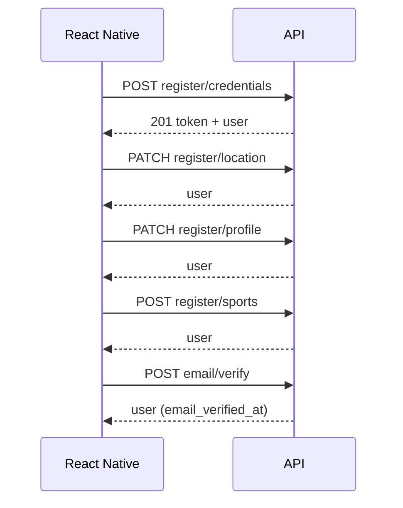

# Wizard d'inscription

Préfixe : `/api/v1/auth`

Routes dans [`routes/api/v1/register.php`](../../routes/api/v1/register.php). L'étape **credentials** est documentée dans [auth.md](./auth.md#post-registercredentials).

Toutes les routes ci-dessous exigent **Bearer Sanctum** (token obtenu à l'étape credentials).

---

## Parcours recommandé



1. **Credentials** — compte + localisation initiale + token ([auth.md](./auth.md))
2. **Location** — affiner adresse (optionnel si déjà renseigné)
3. **Profile** — prénom, nom, pseudo, date de naissance
4. **Sports** — sélection des sports pratiqués
5. **Vérification e-mail** — OTP ([auth.md](./auth.md))

Chaque étape renvoie `{ user }` mis à jour (même structure que [README](./README.md#objet-user-canonique)).

---

## PATCH /register/location

Met à jour la localisation du profil (« Où êtes-vous ? »).

| | |
|---|---|
| **Auth** | Bearer |
| **Content-Type** | `application/json` |

### Corps (tous optionnels)

| Champ | Règles |
|-------|--------|
| `latitude` | nullable, -90 à 90 |
| `longitude` | nullable, -180 à 180 |
| `city` | nullable, string, max 120 |
| `address_line` | nullable, string, max 255 |

Au moins un champ peut être envoyé pour affiner les coordonnées déjà fournies à l'inscription.

### Réponse 200

```json
{
  "user": { }
}
```

---

## PATCH /register/profile

Étape « Parlez-nous de vous » : identité et pseudo.

| | |
|---|---|
| **Auth** | Bearer |

### Corps

| Champ | Règles |
|-------|--------|
| `given_name` | Requis, max 120 |
| `family_name` | Requis, max 120 |
| `handle` | Requis, 3–32 car., `^[a-zA-Z0-9_]+$`, unique |
| `birth_date` | Requis, date passée (`before:today`) |

### Réponse 200

```json
{
  "user": { }
}
```

### Notes RN

- Vérifier la disponibilité du pseudo en temps réel : `GET /register/handle-availability?handle=...` ([auth.md](./auth.md))
- `profile.display_name` est dérivé côté serveur à partir de `given_name` / `family_name`

---

## POST /register/sports

Enregistre les sports choisis (grille multi-sélection).

| | |
|---|---|
| **Auth** | Bearer |

### Corps

| Champ | Règles |
|-------|--------|
| `sport_ids` | Requis, tableau, min 1 élément |
| `sport_ids.*` | Entier distinct, doit exister dans `sports` |

### Réponse 200

```json
{
  "message": "Vos sports ont été enregistrés.",
  "user": { }
}
```

### Erreurs

| Code | Message |
|------|---------|
| **422** | Aucun sport sélectionné |
| **422** | Sport invalide ou supprimé du référentiel |

### Notes RN

Charger la liste des sports via `GET /sports` (public, [auth.md](./auth.md)) avant cette étape.
