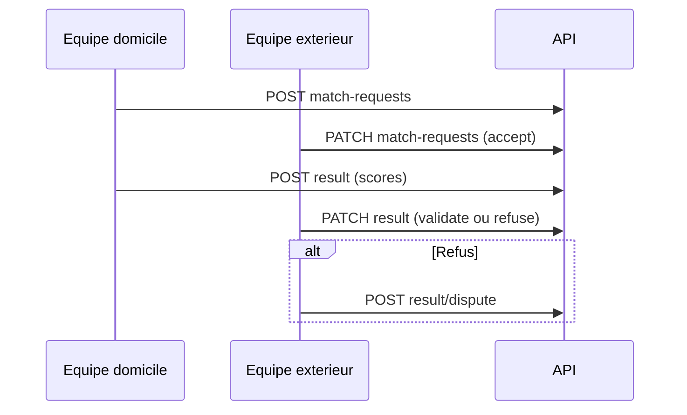

# Équipes, matchs et classements

Préfixe : `/api/v1/auth`

Routes dans [`routes/api/v1/teams.php`](../../routes/api/v1/teams.php). Toutes exigent **Bearer Sanctum**.

Les routes marquées **Abonnement** exigent en plus un abonnement actif (`ensure.subscribed`) → **403** `{ "code": "subscription_required" }`. Voir [billing.md](./billing.md).

**Paramètre URL** : `{team_id}`, `{member_user_id}`, `{asker_user_id}`, `{match_event_id}` sont des entiers (pas de binding modèle nommé).

---

## GET /teams

Liste « Mes équipes » : créées et rejointes.

| | |
|---|---|
| **Throttle** | `auth-team-read` — 60/min |

### Réponse 200

```json
{
  "data": {
    "created": [
      {
        "id": 42,
        "name": "Les Aigles",
        "slug": "les-aigles",
        "sport_id": 3,
        "description": "Club local",
        "hq_city": "Lyon",
        "hq_latitude": 45.75,
        "hq_longitude": 4.85,
        "cover_image_url": "https://...",
        "logo_url": "https://...",
        "competition_type": "leisure",
        "skill_level": "intermediate",
        "members_count": 8,
        "created_at": "2026-01-15T10:00:00.000000Z"
      }
    ],
    "joined": [ ],
    "counts": { "created": 1, "joined": 2 }
  }
}
```

`competition_type` : `leisure` | `competitive`. `skill_level` : `beginner` | `intermediate` | `expert` | null.

---

## GET /teams/search

Recherche d'équipes autour de la localisation du profil connecté (Typesense).

| | |
|---|---|
| **Throttle** | `auth-team-read` |

### Query

| Paramètre | Règles |
|-----------|--------|
| `q` | Optionnel, max 100 (défaut `*`) |
| `sport_id` | Optionnel, existe dans `sports` |
| `competition_type` | Optionnel : `leisure`, `competitive` |
| `skill_level` | Optionnel : `beginner`, `intermediate`, `expert` |
| `radius_km` | Optionnel, 0.1–200 (défaut 100) |
| `per_page` | Optionnel, 1–50 (défaut 10) |
| `page` | Optionnel, 1–10000 (défaut 1) |

### Réponse 200

```json
{
  "data": [
    {
      "id": 42,
      "creator_id": 1,
      "sport_id": 3,
      "name": "Les Aigles",
      "slug": "les-aigles",
      "competition_type": "leisure",
      "skill_level": "intermediate",
      "description": null,
      "hq_city": "Lyon",
      "hq_latitude": 45.75,
      "hq_longitude": 4.85,
      "latitude": 45.75,
      "longitude": 4.85,
      "sport": { "id": 3, "name": "Football", "slug": "football" },
      "cover_image_url": "https://...",
      "logo_url": "https://...",
      "cover_image_blurhash": null,
      "logo_blurhash": null,
      "members_count": 8,
      "distance_meters": 1200,
      "distance_km": 1.2
    }
  ],
  "meta": {
    "found": 12,
    "out_of": 12,
    "page": 1,
    "next_page": 2,
    "per_page": 10,
    "search_time_ms": 3,
    "center": { "latitude": 45.75, "longitude": 4.85, "radius_km": 100 }
  }
}
```

### Erreurs

| Code | Condition |
|------|-----------|
| **422** | Profil sans localisation |
| **502** | Typesense indisponible |

---

## POST /teams

Crée une équipe (le créateur devient captain actif).

| | |
|---|---|
| **Abonnement** | Oui |
| **Throttle** | `auth-team-write` — 30/min |
| **Content-Type** | `multipart/form-data` |

### Corps

| Champ | Règles |
|-------|--------|
| `name` | Requis, unique, max 255 |
| `sport_id` | Requis, existe |
| `description` | Optionnel, max 200 |
| `hq_city` | Optionnel, max 120 |
| `hq_latitude` | Optionnel, -90 à 90 |
| `hq_longitude` | Optionnel, -180 à 180 |
| `cover_image_url` | Requis, fichier image |
| `logo_url` | Requis, fichier image |
| `competition_type` | Optionnel : `leisure`, `competitive` (défaut `leisure`) |
| `skill_level` | Optionnel : `beginner`, `intermediate`, `expert` |

### Réponse 201

```json
{
  "message": "Équipe créée.",
  "team": {
    "id": 42,
    "creator_id": 1,
    "name": "Les Aigles",
    "slug": "les-aigles",
    "description": null,
    "hq_city": "Lyon",
    "hq_latitude": 45.75,
    "hq_longitude": 4.85,
    "cover_image_url": "https://...",
    "logo_url": "https://...",
    "competition_type": "leisure",
    "skill_level": "intermediate",
    "members_count": 1,
    "created_at": "...",
    "updated_at": "...",
    "sport": { "id": 3, "name": "Football", "slug": "football", "practice_type": "collective" }
  }
}
```

---

## PATCH /teams/{team_id}

Met à jour une équipe.

| | |
|---|---|
| **Auth** | Créateur ou captain actif |
| **Throttle** | `auth-team-write` |

### Corps

Tous les champs sont `sometimes` (même sémantique que POST). Images : fichier **ou** chaîne URL max 512 si pas de nouvel upload.

### Réponse 200

```json
{
  "message": "Équipe mise à jour.",
  "team": { }
}
```

---

## DELETE /teams/{team_id}

Suppression définitive.

| | |
|---|---|
| **Auth** | Créateur uniquement |

### Réponse 200

```json
{
  "message": "Équipe supprimée."
}
```

---

## GET /teams/{team_id}/membership

Statut du compte connecté pour cette équipe.

### Réponse 200

```json
{
  "data": {
    "team_id": 42,
    "is_member": true,
    "integration_requested": false,
    "membership_status": "active",
    "role": "member"
  }
}
```

`membership_status` : `active` | `pending` | `rejected` | `left` | null. `integration_requested` : `true` si demande en attente.

---

## GET /teams/{team_id}/profile

Profil équipe (membres paginés).

### Query

| Paramètre | Règles |
|-----------|--------|
| `page` | Optionnel, ≥ 1 (défaut 1) |

### Réponse 200

```json
{
  "data": {
    "id": 42,
    "name": "Les Aigles",
    "hq_city": "Lyon",
    "sport": { "id": 3, "name": "Football", "slug": "football", "practice_type": "collective" },
    "members_count": 8,
    "members": {
      "items": [
        { "user_id": 1, "name": "Jean", "avatar_url": "https://...", "role": "captain" }
      ],
      "pagination": { "current_page": 1, "per_page": 10, "total": 8, "last_page": 1 }
    }
  }
}
```

---

## GET /teams/{team_id}/season-stats

Statistiques agrégées de saison.

### Query

| Paramètre | Règles |
|-----------|--------|
| `year` | Optionnel, 2000–2100 (défaut : année courante) |

### Réponse 200

```json
{
  "data": {
    "team_id": 42,
    "sport_id": 3,
    "year": 2026,
    "season_key": "2026",
    "played": 10,
    "won": 6,
    "lost": 3,
    "draw": 1,
    "point_count": 19
  }
}
```

---

## GET /teams/{team_id}/latest-match

Dernier match à score validé pour l'équipe consultée.

### Réponse 200

Sans match :

```json
{
  "data": { "latest_match": null }
}
```

Avec match :

```json
{
  "data": {
    "latest_match": {
      "match_event_id": 100,
      "match_result_id": 50,
      "validated_at": "2026-04-20T18:00:00.000000Z",
      "home": { "team_id": 1, "name": "A", "logo_url": "https://...", "score": 2 },
      "away": { "team_id": 2, "name": "B", "logo_url": "https://...", "score": 1 },
      "outcome_for_viewing_team": "win"
    }
  }
}
```

`outcome_for_viewing_team` : `win` | `loss` | `draw` (relatif à `{team_id}`).

---

## POST /teams/{team_id}/integrations

Demande d'intégration (utilisateur connecté).

| | |
|---|---|
| **Abonnement** | Oui |

### Corps

Aucun.

### Réponse 201

```json
{
  "message": "Demande d'intégration envoyée."
}
```

### Erreurs 422

Déjà membre actif, sport non collectif, ou déjà une équipe active dans le même sport.

---

## GET /teams/{team_id}/integrations/pending

Liste des demandes en attente (créateur / captain).

### Query

`page` optionnel (défaut 1), 10 par page.

### Réponse 200

```json
{
  "data": {
    "items": [
      {
        "user_id": 5,
        "name": "Jean",
        "email": "jean@example.com",
        "avatar_url": "https://...",
        "requested_at": "2026-05-01T12:00:00.000000Z"
      }
    ],
    "pagination": { "current_page": 1, "per_page": 10, "total": 3, "last_page": 1 }
  }
}
```

---

## PATCH /teams/{team_id}/integrations/{asker_user_id}

Accepte ou refuse une demande d'intégration.

| | |
|---|---|
| **Auth** | Créateur ou captain actif |

### Corps

| Champ | Règles |
|-------|--------|
| `decision` | Requis : `accept` ou `refuse` |

### Réponse 200

```json
{
  "message": "Demande d'intégration traitée."
}
```

---

## DELETE /teams/{team_id}/members/{member_user_id}

Quitte l'équipe (soi-même) ou retire un membre (créateur / captain).

### Réponse 200

Message variable selon l'acteur (départ volontaire vs exclusion).

### Erreurs 422

Membre non actif ; impossible de retirer le créateur.

---

## POST /teams/{team_id}/match-requests

Demande de match (`{team_id}` = équipe **domicile** / demandeur).

| | |
|---|---|
| **Abonnement** | Oui |
| **Auth** | Captain ou créateur de l'équipe domicile |

### Corps

| Champ | Règles |
|-------|--------|
| `away_team_id` | Requis, existe, ≠ domicile |
| `scheduled_at` | Requis, date |
| `venue` | Optionnel, max 255 |
| `notes` | Optionnel, max 2000 |

### Réponse 201

```json
{
  "message": "Demande de match envoyée.",
  "match_event_id": 123
}
```

---

## GET /teams/match-requests

Liste des demandes de match (reçues ou envoyées).

### Query

| Paramètre | Règles |
|-----------|--------|
| `type` | Optionnel : `received` (défaut), `sent` |
| `status` | Optionnel : `pending`, `accepted`, `refused`, `scores_to_confirm`, `finished` |
| `scheduled_at` | Optionnel, date |
| `sport_name` | Optionnel, max 120 |
| `page` | Optionnel, ≥ 1 |

### Réponse 200

```json
{
  "data": {
    "type": "received",
    "status": null,
    "scheduled_at": null,
    "sport_name": null,
    "can_manage_match_requests": true,
    "items": [
      {
        "match_event_id": 123,
        "direction": "received",
        "status": "pending",
        "scheduled_at": "2026-06-01T15:00:00.000000Z",
        "venue": "Stade X",
        "home_team": { "id": 1, "name": "A", "members": [] },
        "away_team": { "id": 2, "name": "B" },
        "sport": { "name": "Football", "practice_type": "collective" },
        "badge": "new"
      }
    ],
    "pagination": { "current_page": 1, "per_page": 10, "total": 1, "last_page": 1 }
  }
}
```

`badge` : `new` si reçu + pending ; sinon reflète `status`. Sports collectifs : `members` sur les équipes.

---

## PATCH /teams/match-requests/{match_event_id}

Décision sur une demande reçue (équipe **extérieur**).

| | |
|---|---|
| **Abonnement** | Oui |
| **Auth** | Captain ou créateur away |

### Corps

| Champ | Règles |
|-------|--------|
| `decision` | Requis : `accept` ou `refuse` |

### Réponse 200

```json
{
  "message": "Demande de match traitée."
}
```

---

## POST /teams/{team_id}/match-events/{match_event_id}/result

Premier envoi : score + 1re évaluation (équipe **domicile** uniquement).

| | |
|---|---|
| **Abonnement** | Oui |
| **Auth** | Captain ou créateur home ; `{team_id}` = `home_team_id` |

### Corps

| Champ | Règles |
|-------|--------|
| `home_score` | Requis, entier 0–999 |
| `away_score` | Requis, entier 0–999 |
| `fair_play_rating` | Requis, 1–5 |
| `punctuality_rating` | Requis, 1–5 |
| `remarks` | Optionnel, max 5000 |

### Réponse 201 ou 200

```json
{
  "message": "Score et évaluation enregistrés.",
  "match_result_id": 50
}
```

---

## PATCH /teams/match-events/{match_event_id}/result

Réponse adverse : validation ou refus (équipe **extérieur**).

| | |
|---|---|
| **Abonnement** | Oui |

### Corps

| Champ | Règles |
|-------|--------|
| `decision` | Requis : `validate` ou `refuse` |
| `refusal_reason` | Requis si `refuse`, max 5000 |
| `fair_play_rating` | Requis si `validate`, 1–5 |
| `punctuality_rating` | Requis si `validate`, 1–5 |
| `remarks` | Optionnel, max 5000 |

### Réponse 200

```json
{
  "message": "Réponse au score enregistrée."
}
```

---

## POST /teams/match-events/{match_event_id}/result/dispute

Litige après refus (équipe extérieur).

| | |
|---|---|
| **Abonnement** | Oui |
| **Content-Type** | `multipart/form-data` si preuve |

### Corps

| Champ | Règles |
|-------|--------|
| `dispute_reason_score_incorrect` | Optionnel, boolean |
| `dispute_reason_fair_play` | Optionnel, boolean |
| `dispute_reason_behavior` | Optionnel, boolean |
| `details` | Requis, max 10000 |
| `evidence` | Optionnel, image, max 5120 Ko |

Au moins une raison booléenne doit être `true`.

### Réponse 201

```json
{
  "message": "Litige envoyé.",
  "match_result_dispute_id": 7
}
```

---

## GET /teams/rankings

Classement par sport et année.

### Query

| Paramètre | Règles |
|-----------|--------|
| `sport_id` | Requis |
| `year` | Optionnel (défaut année courante) |
| `page` | Optionnel (défaut 1) |

### Réponse 200

```json
{
  "data": {
    "sport_id": 3,
    "year": 2026,
    "season_key": "2026",
    "rankings": [
      {
        "rank": 1,
        "team_id": 42,
        "team_name": "Les Aigles",
        "logo_url": "https://...",
        "victory_count": 5,
        "draw_count": 1,
        "defeat_count": 2,
        "point_count": 16,
        "is_current_user_team": true
      }
    ],
    "pagination": { "current_page": 1, "per_page": 10, "has_more": false }
  }
}
```

---

## GET /teams/rankings/years

Années disponibles pour le dropdown classement.

### Query

`sport_id` requis.

### Réponse 200

```json
{
  "data": {
    "sport_id": 3,
    "years": [2026, 2025, 2024]
  }
}
```

---

## Route non exposée

`GET /teams/{team_id}` (détail équipe, membre actif) est **commentée** dans le code. Utiliser `GET /teams/{team_id}/profile` et `GET /teams` à la place.

---

## Flux match (résumé)


